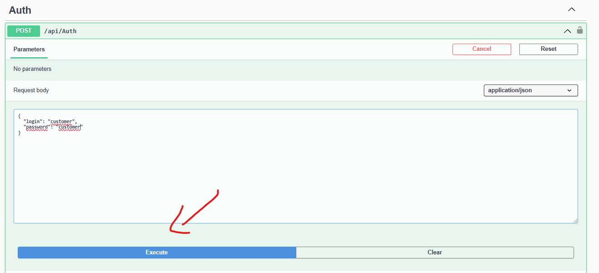
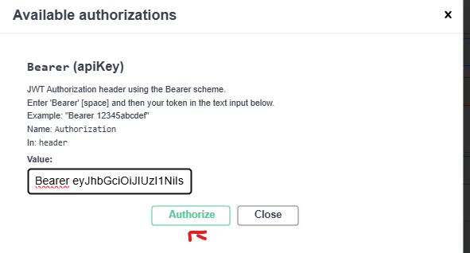

# Code Challenge - Investment Api

### This project is responsible of managing investments using api endpoints

### Instalation Proccess

***First at all, make sure you have Docker installed***

 - Clone this project inside your machine
 - Run the following command: `docker compose up`
 - API App should be available on [APP link](http://localhost:8080/swagger)

## *Important disclaimer*

The following steps will be using Swagger internal endpoint tool in order to call api endpoints. Feel free to use any other HTTP client.

### Authenticate

After accessing the Swagger endpoint, please follow the steps below:
 - Find /api/Auth endpoint and click on it
 - Click on "Try it out"
 - Replace login and password with the predefined accounts
 - Click on execute 
 - Copy the token value
 - Go over "Authorize" button and type: "Bearer " and paste the token after the space keyword (E.g. Bearer token...)
 - Click on "Authorize" 
  
    

### Admin features

*Please follow "Authenticate" step by using "admin" as login and password* :)

#### Get products

This endpoint is responsible of returning all available financial products in the database.

Route [GET]:
http://localhost:8080/api/admin/products

Sample response:
`
[
  {
    "id": "0e59f5c6-81a1-459d-84bc-2f187f275379",
    "expires": "2024-06-29T04:24:15.37004Z",
    "name": "LCA",
    "description": "LCA Loren Ipsun",
    "riskLevel": 5,
    "mininumInvestment": 1000
  },
  {
    "id": "251c9c19-0053-447a-bb64-06c5926a99d9",
    "expires": "2024-11-23T04:24:15.370039Z",
    "name": "CDB",
    "description": "CDB Loren Ipsun",
    "riskLevel": 5,
    "mininumInvestment": 50
  },
  {
    "id": "ad8dbd67-1d38-4503-8f8f-3a4c82d52aad",
    "expires": "2024-12-23T04:24:15.37004Z",
    "name": "LCI",
    "description": "LCI Loren Ipsun",
    "riskLevel": 5,
    "mininumInvestment": 500
  }
]
`

#### Update product

This endpoint is responsible of updating a specific financial product

Route [PUT]:
http://localhost:8080/api/admin/product/{productId}

Sample request:
All fields are optional, you may spcefify only the field you want to update.

`
{
  "enabled": true, 
  "minimumInvestment": 0,
  "riskLevel": 0,
  "name": "string",
  "description": "string",
  "expires": "2024-06-25T03:02:14.488Z"
}
`

### User features

*Please follow "Authenticate" step by using "customer" as login and password* :)

#### Get User

Returns user investment summary with given operation events and available amount to invest

Route [GET]:
http://localhost:8080/api/user

Sample response:
`
{
  "availableAmount": 5000,
  "investments": []
}
`

#### Get Products

Returns all available products to invest

Route [GET]:
http://localhost:8080/api/user/products

Sample response:
`
[
  {
    "id": "251c9c19-0053-447a-bb64-06c5926a99d9",
    "expires": "2024-11-23T04:24:15.370039Z",
    "name": "CDB",
    "description": "CDB Loren Ipsun",
    "riskLevel": 5,
    "mininumInvestment": 50
  },
  {
    "id": "0e59f5c6-81a1-459d-84bc-2f187f275379",
    "expires": "2024-06-29T04:24:15.37004Z",
    "name": "LCA",
    "description": "LCA Loren Ipsun",
    "riskLevel": 5,
    "mininumInvestment": 1000
  },
  {
    "id": "ad8dbd67-1d38-4503-8f8f-3a4c82d52aad",
    "expires": "2024-12-23T04:24:15.37004Z",
    "name": "LCI",
    "description": "LCI Loren Ipsun",
    "riskLevel": 5,
    "mininumInvestment": 500
  }
]
`

#### Buy Product

Invest on a product.

Route [POST]:
http://localhost:8080/api/user/buy

Sample Request

`
{
  "financialProductId": "3fa85f64-5717-4562-b3fc-2c963f66afa6",
  "amount": 0
}
`

#### Sell Product

Sell a already invested product.

Route [POST]:
http://localhost:8080/api/user/sell

Sample Request

`
{
  "financialProductId": "3fa85f64-5717-4562-b3fc-2c963f66afa6",
  "amount": 0
}
`

